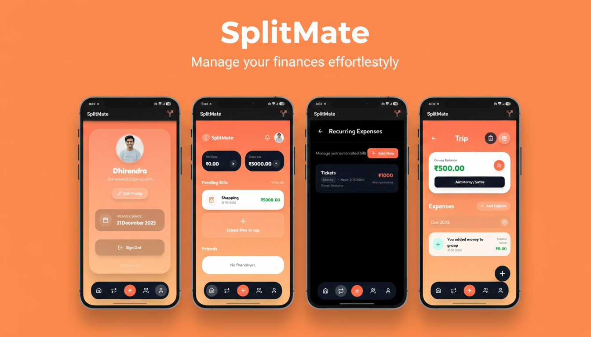

# SpliteMate - Smart Expense Splitter

Splite is a modern, mobile-first web application designed to make sharing expenses with friends and roommates seamless and fun. Built with the latest web technologies, it offers a premium user experience for managing group finances.

 <!-- Add a screenshot if available -->

## 🚀 Features

*   **Group Management**: Create groups for trips, daily expenses, or special occasions.
*   **Expense Splitting**: multiple split modes:
    *   **Equal**: Split equally among all members.
    *   **Unequal**: Specify exact amounts for each person.
    *   **Shares**: Split by shares (e.g., 2 shares vs 1 share).
    *   **Percentage**: Split by custom percentages.
    *   **Single**: Allocate the entire expense to one person.
*   **Smart Dashboard**: Real-time view of "You Owe" and "Owes You" balances.
*   **Recurring Bills**: Set up automated weekly, monthly, or yearly bills (e.g., Rent, Netflix).
*   **Lucky Draw (Roulette)**: A fun "Gift" feature to randomly decide who pays for the next meal or drink! 🎁
*   **Friend System**: Add friends and manage direct settlements.
*   **Mobile First**: Fully responsive design with a bottom navigation bar for easy access on the go.

## 🛠️ Tech Stack

*   **Framework**: [Next.js 16](https://nextjs.org/) (App Router, Turbopack)
*   **Language**: [TypeScript](https://www.typescriptlang.org/)
*   **Styling**: [Tailwind CSS 4](https://tailwindcss.com/) & [Lucide React](https://lucide.dev/)
*   **Database**: [MongoDB](https://www.mongodb.com/) (Mongoose)
*   **Authentication**: Custom JWT / NextAuth
*   **Animation**: Framer Motion

## 📦 Installation

1.  **Clone the repository**
    ```bash
    git clone https://github.com/yourusername/splite.git
    cd splite
    ```

2.  **Install dependencies**
    ```bash
    npm install
    ```

3.  **Set up Environment Variables**
    Create a `.env` file in the root directory and add the following:
    ```env
    MONGO_URI=your_mongodb_connection_string
    TOKEN_SECRET=your_jwt_secret_key
    domain=http://localhost:3000
    ```

4.  **Run the development server**
    ```bash
    npm run dev
    ```

    Open [Live preview ](https://splitemate2-0-frmm.vercel.app/) with your browser to see the result.

## 🤝 Contributing

Contributions are welcome! Please feel free to submit a Pull Request.
